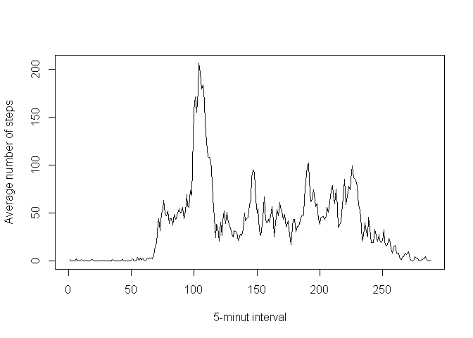
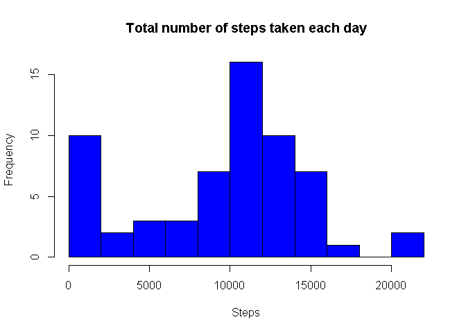
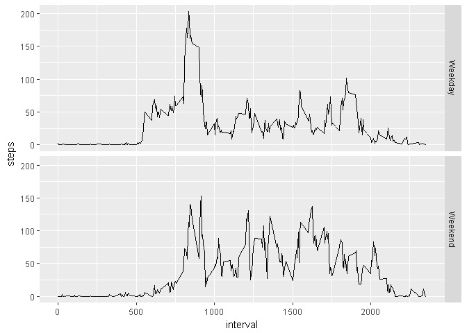

## Loading and preprocessing the data

```r
if(!file.exists("activity.zip")){
  url <- "https://d396qusza40orc.cloudfront.net/repdata%2Fdata%2Factivity.zip"
  download.file(url,"activity.zip")
  unzip("activity.zip")
}

activity <- read.csv("activity.csv", header = TRUE)
activity$date <- as.Date(activity$date, "%Y-%m-%d")
library(dplyr)
```

```
## 
## Attaching package: 'dplyr'
```

```
## The following objects are masked from 'package:stats':
## 
##     filter, lag
```

```
## The following objects are masked from 'package:base':
## 
##     intersect, setdiff, setequal, union
```

```r
library(ggplot2)
```

## What is mean total number of steps taken per day?


```r
##Calculate the total number of steps taken per day

sspd<-activity %>% group_by(date) %>% summarise(sum = sum(steps, na.rm = TRUE))

 ##Make a histogram of the total number of steps taken each day
 
 hist(sspd$sum, main = "Total number of steps taken each day", xlab = "Steps", col = "red", breaks = 10)
```

<!-- -->

```r
 ##Calculate and report the mean and median of the total number of steps taken per day
 
 mean(sspd$sum,na.rm = TRUE)
```

```
## [1] 9354.23
```

```r
 median(sspd$sum,na.rm = TRUE)
```

```
## [1] 10395
```


## What is the average daily activity pattern?


```r
 ##Make a time series plot (i.e. type = "l") of the 5-minute interval (x-axis) and the average number of steps taken, averaged across all days (y-axis)
 
 interval_act<-activity %>% group_by(interval) %>% summarise(mean(steps, na.rm = TRUE))
 plot(interval_act$`mean(steps, na.rm = TRUE)`,type = 'l', ylab = "Average number of steps", xlab = "5-minut interval")
```

<!-- -->

```r
 ##Which 5-minute interval, on average across all the days in the dataset, contains the maximum number of steps?
 
 interval_act[which.max(interval_act$`mean(steps, na.rm = TRUE)`),"interval"]
```

```
## # A tibble: 1 x 1
##   interval
##      <int>
## 1      835
```


## Imputing missing values

```r
 ##Calculate and report the total number of missing values in the dataset (i.e. the total number of rows with NAs)
 
  summary(activity)
```

```
##      steps             date               interval     
##  Min.   :  0.00   Min.   :2012-10-01   Min.   :   0.0  
##  1st Qu.:  0.00   1st Qu.:2012-10-16   1st Qu.: 588.8  
##  Median :  0.00   Median :2012-10-31   Median :1177.5  
##  Mean   : 37.38   Mean   :2012-10-31   Mean   :1177.5  
##  3rd Qu.: 12.00   3rd Qu.:2012-11-15   3rd Qu.:1766.2  
##  Max.   :806.00   Max.   :2012-11-30   Max.   :2355.0  
##  NA's   :2304
```

```r
  ##Devise a strategy for filling in all of the missing values in the dataset. The strategy does not need to be sophisticated. For example, you could use the mean/median for that day, or the mean for that 5-minute interval, etc.
  
  ## My strategy is to apply the mean of a day to NAs of that day and 0 if all values are NA in a given day
  
  new_activity <- read.csv("activity.csv", header = TRUE)
  new_activity$date <- as.Date(new_activity$date, "%Y-%m-%d")
  new_activity$steps <- as.numeric(new_activity$steps)
  mean_by_day<-new_activity %>% group_by(date) %>% summarise(mean = mean(steps, na.rm = TRUE))
  
  for(i in 1:nrow(mean_by_day)){
    if(is.na(mean_by_day[i,2])){
      mean_by_day[i,2] <- 0
    }
  }

  for(i in 1:nrow(new_activity)){
    if(is.na(new_activity[i,1])){
      select <- select(filter(mean_by_day, date == new_activity[i,2]),mean)
      new_activity[i,1] <- select
    }
    
  }
  
  
summary(new_activity)
```

```
##      steps             date               interval     
##  Min.   :  0.00   Min.   :2012-10-01   Min.   :   0.0  
##  1st Qu.:  0.00   1st Qu.:2012-10-16   1st Qu.: 588.8  
##  Median :  0.00   Median :2012-10-31   Median :1177.5  
##  Mean   : 32.48   Mean   :2012-10-31   Mean   :1177.5  
##  3rd Qu.:  0.00   3rd Qu.:2012-11-15   3rd Qu.:1766.2  
##  Max.   :806.00   Max.   :2012-11-30   Max.   :2355.0
```

```r
 ##Make a histogram of the total number of steps taken each day and Calculate and report the mean and median total number of steps taken per day. Do these values differ from the estimates from the first part of the assignment? What is the impact of imputing missing data on the estimates of the total daily number of steps?

 new_sspd<-new_activity %>% group_by(date) %>% summarise(sum = sum(steps, na.rm = TRUE))
 hist(new_sspd$sum, main = "Total number of steps taken each day", xlab = "Steps", col = "blue", breaks = 10)
```

<!-- -->

```r
 mean(new_sspd$sum,na.rm = TRUE)
```

```
## [1] 9354.23
```

```r
 median(new_sspd$sum,na.rm = TRUE)
```

```
## [1] 10395
```

```r
 ## There is no visible change since I have used the mean of each day to substitute NAs and 0 where ever all values were NAs for a given day
```


## Are there differences in activity patterns between weekdays and weekends?

```r
 weekdays <- weekdays(new_activity$date)
 
 new_activity <- new_activity %>% mutate(weekdays = weekdays)
 
 for(i in 1:nrow(new_activity)){
   if(new_activity[i,4] == "Monday" | new_activity[i,4] == "Tuesday" | new_activity[i,4] == "Wednesday" | new_activity[i,4] == "Thursday" | new_activity[i,4] == "Friday"){
     new_activity[i,4] <- "Weekday"
   } else{new_activity[i,4]<- "Weekend"}
    
 }
 
 int_weekdays_group <- group_by(new_activity, interval, weekdays)
 sspd2 <- summarise(int_weekdays_group, steps = mean(steps, na.rm = TRUE))
 qplot(interval,steps, data = sspd2,facets = weekdays~., geom="line")
```

<!-- -->
